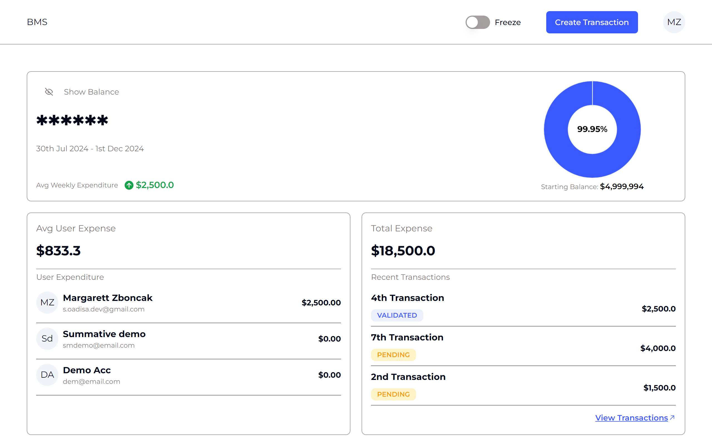

# Budget Management System (BMS)

## Overview

The Budget Management System (BMS) is a web-based application designed to help
users manage and monitor their budgets effectively. It allows users to freeze
and unfreeze budgets, track expenses, and get a comprehensive view of their
financial status.

## Table of Contents

- [Technologies Used](#technologies-used)
- [Project Structure](#project-structure)
- [Prerequisites](#prerequisites)
- [Installation](#installation)
  - [Backend](#backend)
  - [Frontend](#frontend)
- [Usage](#usage)
- [Screenshots](#screenshots)
- [License](#license)
- [Author](#author)
- [Contact Information](#contact-information)

## Technologies Used

- **Frontend:** Next.js
- **Backend:** NestJS

## Project Structure

This project is organized as a monorepo, containing both the backend and
frontend applications.

```
translucent-bms
│
├── bms-backend
│   ├── src
│   │   ├── main.ts
│   │   ├── app.module.ts
│   │   ├── ...
│   ├── prisma
│   │   ├── schema.prisma
│   ├── .env.example
│   ├── package.json
│   ├── ...
│
├── bms-frontend
│   ├── src
│   │   ├── app
│   │   │   ├── ...
│   │   ├── components
│   │   │   ├── ...
│   │   ├── lib
│   │   │   ├── api
│   │   │   │   ├── budget
│   │   │   │   │   ├── budget.ts
│   │   │   │   ├── ...
│   │   ├── types
│   │   │   ├── ...
│   ├── public
│   │   ├── images
│   ├── .env.example
│   ├── package.json
│   ├── ...
```

## Prerequisites

Before you begin, ensure you have the following installed on your system:

- Node.js
- npm (Node Package Manager)
- PostgreSQL
- OpenSSL (for generating secret keys | optional)

## Installation

### Backend

1. **Clone the Repository:**
   ```bash
   git clone https://github.com/Adisa-Shobi/translucent-bms.git
   cd translucent-bms/bms-backend
   ```

2. **Set up Environment Variables:**
   - Create a `.env` file in the root of your project.
   - Use `.env.example` as a guide to set up your environment variables,
     including the PostgreSQL database URL and other secrets.
   - To generate a secret key, you can use the following command:
     ```bash
     openssl rand -base64 32
     ```
   - Copy the generated key and add it to your `.env` file as `JWT_SECRET`.

   Example `.env` file:
   ```plaintext
   DATABASE_URL=your_postgres_db_url
   JWT_SECRET=your_generated_secret_key
   ```

3. **Install Dependencies:**
   ```bash
   npm install
   ```

4. **Generate Prisma Client:**
   ```bash
   npx prisma generate
   ```

5. **Run Prisma Migrations:**
   ```bash
   npx prisma migrate dev --name init
   ```

6. **Start the NestJS Server:**
   ```bash
   npm run start:dev
   ```

### Frontend

1. **Navigate to the frontend directory:**
   ```bash
   cd ../bms-frontend
   ```

2. **Set up Environment Variables:**
   - Create a `.env` file in the root of your project.
   - Use `.env.example` as a guide to set up your environment variables,
     including the API endpoint URL pointing to your backend instance.

   Example `.env` file:
   ```plaintext
   NEXT_PUBLIC_API_ENDPOINT="http://localhost:8080"
   ```

3. **Install Dependencies:**
   ```bash
   npm install
   ```

4. **Start the Next.js Development Server:**
   ```bash
   npm run dev
   ```

## Usage

After setting up both the backend and frontend, you can access the Budget
Management System in your browser at `http://localhost:3000` (or the port you've
configured).

- **Login and Signup:** Users can create accounts and log in.
- **Dashboard:** Overview of budget status, recent transactions, and key
  financial metrics.
- **Budget Management:** Create, freeze, and unfreeze budgets.
- **Expense Tracking:** Add and categorize expenses.
- **Stats:** View Stats on spending habits and budget utilization.

## Screenshots

 _Login Screen_

 _Dashboard_

## License

This project is licensed under the MIT License.

## Author

This project was created by Shobi Ola-Adisa.

## Contact Information

If you have any questions or need support, please contact me at
[s.oadisa.dev@gmail.com].

---
